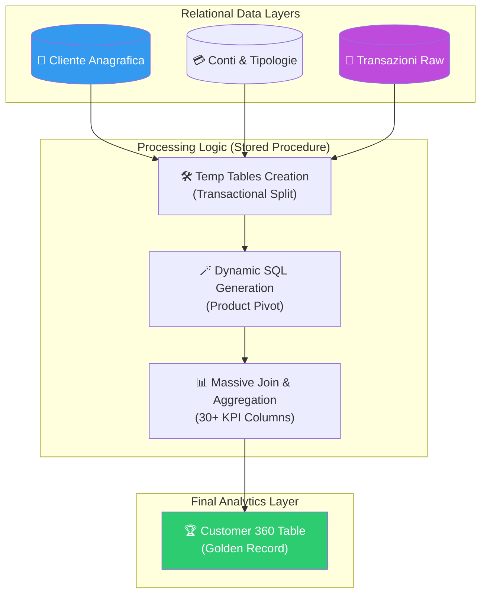
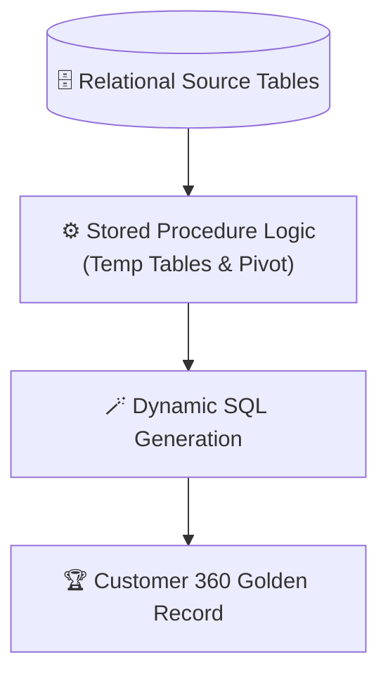

# 🏦 BancaInsight: Financial Data Engineering & Customer 360 Analytics

<p align="center">
  
  
  
  
  
</p>

**BancaInsight** è un'infrastruttura di analisi SQL avanzata progettata per la generazione di una vista **Customer 360** all'interno del dominio bancario. Il progetto implementa una pipeline di aggregazione complessa tramite Stored Procedures e Dynamic SQL, trasformando database relazionali altamente normalizzati in una tabella "flat" ad alte prestazioni, pronta per alimentare modelli di Machine Learning (es. Churn Prediction) o dashboard di BI executive.

## 🏢 Valore Enterprise & Settori di Applicazione

| Settore / Ambito | Rilevanza & Benefici |
|-------------------|-----------|
| **Banking & Finance** | Consolidamento della posizione cliente tra più prodotti (conti, carte, investimenti) per una segmentazione comportamentale accurata. |
| **CRM & Marketing Automation** | Fornitura di dataset aggregati ("Golden Record") per la personalizzazione delle offerte e il calcolo della propensione all'abbandono. |
| **Financial Reporting** | Automazione della reportistica operativa su volumi transazionali massivi tramite logiche di aggregazione scalabili. |
| **Data Migration & ETL** | Implementazione di pattern di trasformazione dati direttamente all'interno del DWH per massimizzare le performance (ELT). |

---

## 🎯 Executive Summary & Valore di Business
BancaInsight risolve il collo di bottiglia del data preparation, automatizzando l'estrazione di oltre 30 KPI critici per ogni singolo cliente in un'unica operazione atomica.

### 🏛️ 1. Ingegneria SQL Dinamica
* **Pivot a Runtime:** Invece di hard-codare le tipologie di conto, il sistema utilizza `GROUP_CONCAT` e `PREPARE/EXECUTE` per costruire dinamicamente lo schema della tabella finale. Questo permette al sistema di adattarsi automaticamente all'aggiunta di nuovi prodotti bancari senza modifiche al codice.
* **Catena di Join Ottimizzata:** Implementazione di una sequenza di `LEFT JOIN` su tabelle temporanee caricate in memoria, garantendo la conservazione dell'anagrafica cliente anche in assenza di transazioni recenti (Data Integrity).

### ⚙️ 2. Customer 360 KPI Groups
La stored procedure aggrega 11 macro-gruppi di metriche, fornendo una profondità analitica senza precedenti:
* **Comportamento Transazionale:** Conteggio e importi medi di entrate/uscite segmentati per tipologia di conto (Base, Business, Family, Private).
* **Metriche Demografiche:** Calcolo dinamico dell'età e segmentazione anagrafica integrata nel record transazionale.
* **Enforcement di Default:** Utilizzo sistematico di `COALESCE` per gestire i valori nulli, garantendo un dataset pulito e pronto per l'analisi statistica.

### 🛡️ 3. Efficienza Operativa
* **Automazione Totale:** La logica è incapsulata in un unico script SQL eseguibile via scheduler, riducendo l'errore umano e i tempi di elaborazione rispetto a pipeline di data preparation manuali.

---

## 🏗️ Architettura del Ciclo di Aggregazione



## 🛠️ Stack Tecnologico

| Layer | Tecnologia | Ruolo |
|:------|:-----------|:-----|
| 🗄️ **Database** | MySQL 8.x | RDBMS & Analytics Engine |
| ⚙️ **Logic** | Stored Procedures | Encapsulated Transformation Logic |
| 🪄 **Dynamic SQL** | PREPARE / EXECUTE | Adaptive Schema Generation |
| 📊 **Analytics** | SQL Aggregate Functions | KPI Calculation |

## 🚀 Esecuzione

```sql
-- Inizializzazione del database
USE banca;

-- Esecuzione della pipeline di analisi
SOURCE analisi_clienti.sql;

-- Accesso al Data Product finale
SELECT * FROM analisi_clienti;
```

<br><br>

*Progettato e sviluppato da Eugenio Pasqua.*

---

# 🇬🇧 ENGLISH VERSION

# 🏦 BancaInsight: Financial Data Engineering & Customer 360 Analytics

<p align="center">
  
  
</p>

**BancaInsight** is an advanced SQL analysis infrastructure designed to generate a **Customer 360** view within the banking domain. The project implements a complex aggregation pipeline using Stored Procedures and Dynamic SQL, transforming highly normalized relational databases into a high-performance "flat" table, ready for Machine Learning models or executive BI dashboards.

## 🏢 Enterprise Value & Application Sectors

| Sector / Domain | Relevance & Benefits |
|-------------------|-----------|
| **Banking** | Consolidating customer positions across products for accurate behavioral segmentation. |
| **CRM & Marketing** | Providing "Golden Records" for offer personalization and churn propensity modeling. |
| **Data Engineering** | Implementing ELT (Extract, Load, Transform) patterns directly within the DWH for maximum performance. |

---

## 🏗️ Aggregation Cycle Architecture



## 🧰 Technology Stack

`MySQL 8.x` · `Stored Procedures` · `Dynamic SQL` · `PREPARE/EXECUTE` · `GROUP_CONCAT` · `Temporary Tables`

<br><br>

*Designed and developed by Eugenio Pasqua.*
